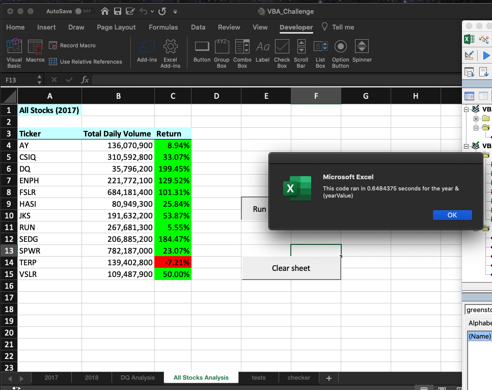
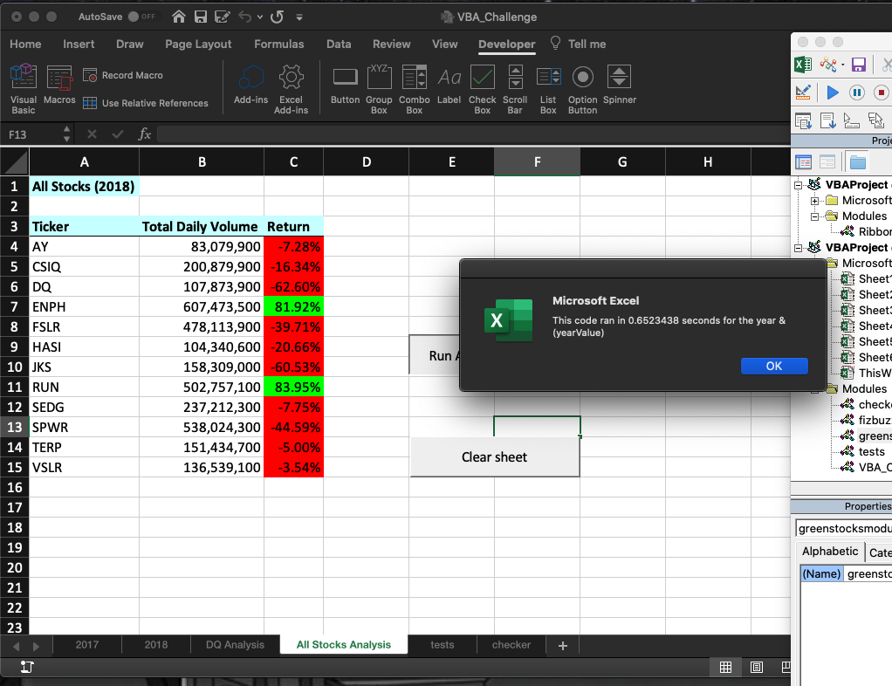
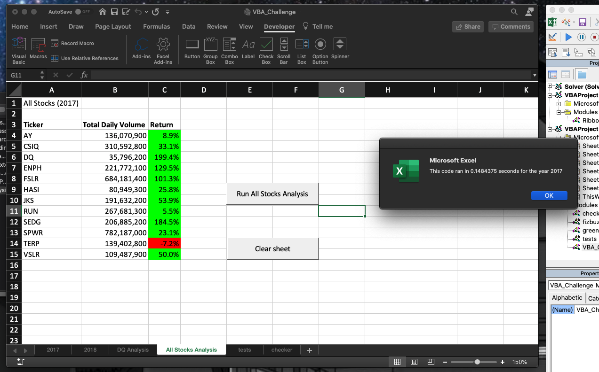
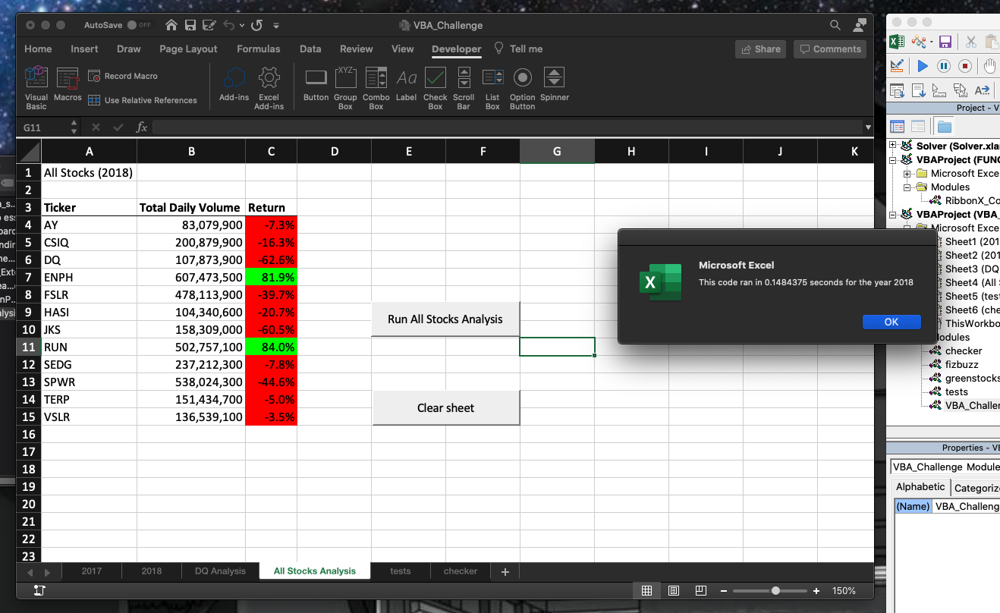

# Stock-Analysis

## Overview of Project 
The purpose of this project was to refactor the code we wrote in module 2. The code written in module 2 was inefficient and would not scale well. Steve needed a program that could grow with his needs. While the original code worked, as Steve added more and more stocks for it to analyze, its capabilities would be greatly reduced. Our goal was to deliver Steve a product that could be expanded and still efficiently run. We will not be adding any new features, only improving the codes performance.

## Results 
Refactoring our code made a drastic improvement in the run time of our code. As you can see in these images  
 my unfactored, original module 2 run times were 0.64 seconds and 0.65 seconds for 2017 and 2018, respectively. 
 
After the refactoring of the code, you can see from these screenshots 
 the run times for 2017 and 2018, were both 0.15 seconds. 
 
With just this refactoring, the code is now executed 426% faster. 
 

By creating the variables used to save the output data to as arrays, we were able to drastically improve the run time of this code.  

## Summary
### Advantages
The advantages of refactoring this code should be apparent. By reducing the amount of times the program had to loop through the data, we were able to drastically reduce the run time of the code by over 400%. This allows for much more room to scale the code with more stock data. 

The only advantage of the original unfactored code is that it worked the first time. If you were in a time crunch, the original would get you by. A lay-person would not know its weaknesses, and at the click of a button, they would have the answers they wanted.

### Disadvantages
The only disadvantages I can see in refactoring this code is the amount of time needed to complete the refactoring. If you were pressed for time, refactoring might not be an option, and this would have to have been implemented as is. 

The biggest disadvantage of the original code was its run time. While it worked, it worked slowly. If the original code had been scaled for use with many more stocks, the run time could become an issue, potentially to the point where it no longer ran.  

